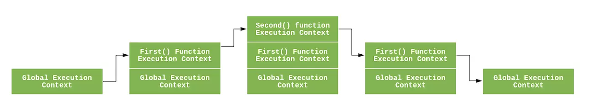

# 理解JavaScript 中的执行上下文和执行栈
### 定义
执行上下文：在运行JavaScript代码时由JavaScript引擎创建的一个环境。这个环境决定了代码在执行时变量如何被访问以及如何被求值。

### 执行上下文的类型
 * **全局执行上下文`GlobalExectionContext`**：只有一个，浏览器中的全局对象就是indow对象，`this`指向这个全局对象。
 * **函数执行上下文`FunctionExectionContext`**:存在无数个，只有函数被调用的时候才会被创建，每次调用函数都会创建一个新的执行上下文。
 * **Eval函数执行上下文**：指的是运行在 eval 函数中的代码，很少用而且不建议使用。

```js

GlobalExectionContext = {  // 全局执行上下文
  LexicalEnvironment: {    	  // 词法环境
    EnvironmentRecord: {   		// 环境记录
      Type: "Object",      		   // 全局环境
      // 标识符绑定在这里 
      outer: <null>  	   		   // 对外部环境的引用
  }  
}

FunctionExectionContext = { // 函数执行上下文
  LexicalEnvironment: {  	  // 词法环境
    EnvironmentRecord: {  		// 环境记录
      Type: "Declarative",  	   // 函数环境
      // 标识符绑定在这里 			  // 对外部环境的引用
      outer: <Global or outer function environment reference>  
  }  
}
```
  vscode 中编辑markdown 常用命令vscode 中编辑markdown 常用命令
### 执行上下文的组成
* **变量对象（Varible Object VO）**:存储着上下文中所有的变量、函数声明以及函数参数。函数中的参数也被存储在变量对象中。对于函数执行上下文来说，变量对象也被称为活动对象（Activation Object，AO）。
* **作用域链（Scope Chain）**：每个执行上下文都有一个与之关联的作用域链，它是用于解析变量的一个对象列表。作用域链的前端是当前执行上下文的变量对象。当访问一个变量时，Js引擎首先查找当前执行上下文的变量对象，如果找不到，就会沿着作用域链向上查找知道找到该变量或者到达全局执行上下文的变量对象。
* **this Bind**：在上下文中，有一个特殊的关键字this，它在代码执行过程中可能指向不同的对象。在全局执行上下文中，this通常指向全局对象（浏览器中是window）。在函数执行上下文中，this的值取决于函数是如何被调用的。如果它是一个方法，this通常指向调用它的对象。
  
### 执行栈
执行栈，也叫**调用栈**，具有 LIFO（后进先出）结构，用于存储在代码执行期间创建的所有执行上下文。
首次运行JS代码时，会创建一个全局执行上下文`GlobalExectionContext`并Push到当前的执行栈中。每当发生函数调用，引擎都会为该函数创建一个新的函数执行上下文`FunctionExectionContext`并Push到当前执行栈的栈顶。
根据执行栈LIFO规则，当栈顶函数运行完成后，其对应的函数执行上下文将会从执行栈中Pop出，上下文控制权将移到当前执行栈的下一个执行上下文。

```js
var a = 'Hello World!';

function first() {  
  console.log('Inside first function');  
  second();  
  console.log('Again inside first function');  
}

function second() {  
  console.log('Inside second function');  
}

first();  
console.log('Inside Global Execution Context');

// Inside first function
// Inside second function
// Again inside first function
// Inside Global Execution Context
```



一般来说，上下文的代码会运行到完成，但是正如我们上面提到的，某些对象（例如生成器）可能会违反堆栈的 LIFO 顺序。生成器函数可以挂起其运行上下文，并在完成之前将其从堆栈中删除。一旦生成器再次被激活，它的上下文就会恢复并再次被压入堆栈.
```js
function *gen() {
  yield 1;
  return 2;
}
 
let g = gen();
 
console.log(
  g.next().value, // 1
  g.next().value, // 2
);
```
这里的语句yield将值返回给调用者，并弹出上下文。在第二次next调用时，相同的上下文再次被推入堆栈并恢复。这样的上下文可能比创建它的调用者更长寿，因此违反了 LIFO 结构。

详细了解了这个过程之后，我们就可以对 执行上下文栈 总结一些结论了。
* JavaScript 引擎是单线程的
* 同步执行，只有栈顶的上下文处于执行中，其他上下文需要等待
* 全局上下文只有唯一的一个，它在浏览器关闭时出栈
* 函数的执行上下文的个数没有限制
* 每次某个函数被调用，就会有个新的执行上下文为其创建，即使是调用的自身函数，也是如此

### 执行上下文的创建